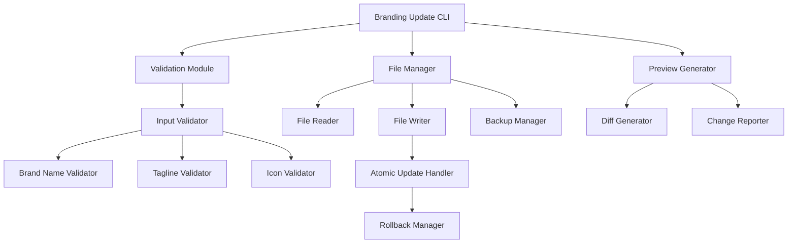
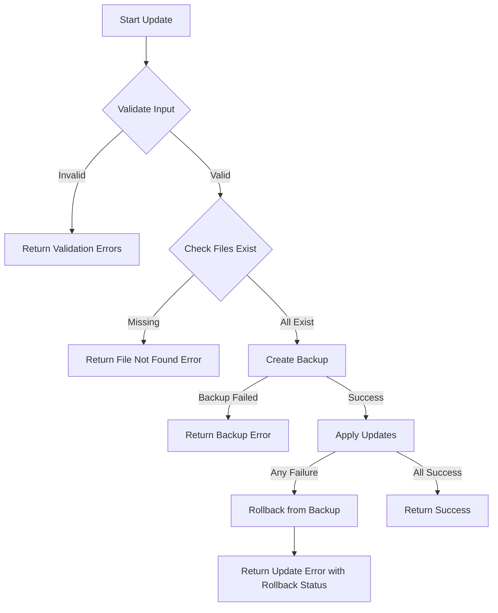

# Design Document: TravelSmart Branding Update

## Overview

This design document specifies the technical approach for updating the TravelSmart application branding across all touchpoints. The feature enables atomic updates to brand identity elements (brand name, icon, and tagline) while preserving application functionality and maintaining consistency across the codebase.

The branding update system will be implemented as a Python script that performs validated text replacements across multiple files including documentation (README.md), HTML templates (navbar, footer, base), and ensures all changes are applied atomically to prevent inconsistent branding states.

### Scope

**In Scope:**
- Brand name updates across all files
- Brand icon (emoji) updates in visual components
- Tagline updates in documentation and templates
- Copyright notice updates in footer
- Input validation for branding elements
- Preview functionality before applying changes
- Atomic file updates with rollback capability

**Out of Scope:**
- Database schema changes
- Python application logic modifications
- CSS styling changes
- Image asset updates
- Internationalization/localization
- Version control integration (git commits)

## Architecture

### System Components



### Component Responsibilities

1. **Branding Update CLI**: Command-line interface for initiating branding updates with preview and apply modes
2. **Validation Module**: Validates all branding inputs against defined constraints
3. **File Manager**: Handles reading, writing, and backup operations for target files
4. **Preview Generator**: Creates preview reports showing current vs. proposed changes
5. **Atomic Update Handler**: Ensures all file updates succeed or none are applied

## Components and Interfaces

### 1. BrandingConfig Class

**Purpose**: Encapsulates branding configuration data

```python
@dataclass
class BrandingConfig:
    brand_name: str
    brand_icon: str
    tagline: str
    
    def validate(self) -> List[str]:
        """Validate all branding elements and return list of errors"""
```

**Responsibilities:**
- Store branding configuration values
- Provide validation interface
- Serialize/deserialize configuration

### 2. BrandingValidator Class

**Purpose**: Validates branding inputs against business rules

```python
class BrandingValidator:
    MIN_BRAND_NAME_LENGTH = 1
    MAX_BRAND_NAME_LENGTH = 50
    MIN_TAGLINE_LENGTH = 10
    MAX_TAGLINE_LENGTH = 200
    
    def validate_brand_name(self, name: str) -> Optional[str]:
        """Returns error message if invalid, None if valid"""
    
    def validate_tagline(self, tagline: str) -> Optional[str]:
        """Returns error message if invalid, None if valid"""
    
    def validate_icon(self, icon: str) -> Optional[str]:
        """Returns error message if invalid, None if valid"""
```

**Validation Rules:**
- Brand name: 1-50 characters, non-empty
- Tagline: 10-200 characters
- Icon: 1-4 characters (emoji support)

### 3. FileTarget Class

**Purpose**: Represents a file to be updated with specific replacement patterns

```python
@dataclass
class FileTarget:
    path: str
    replacements: List[Tuple[str, str]]  # (old_text, new_text) pairs
    
    def exists(self) -> bool:
        """Check if file exists"""
    
    def read_content(self) -> str:
        """Read current file content"""
    
    def apply_replacements(self, content: str) -> str:
        """Apply all replacements to content"""
```

### 4. BrandingUpdater Class

**Purpose**: Orchestrates the branding update process

```python
class BrandingUpdater:
    def __init__(self, config: BrandingConfig):
        self.config = config
        self.validator = BrandingValidator()
        self.file_manager = FileManager()
    
    def preview(self) -> PreviewReport:
        """Generate preview of changes without applying"""
    
    def apply(self, backup: bool = True) -> UpdateResult:
        """Apply branding updates atomically"""
    
    def rollback(self, backup_id: str) -> bool:
        """Rollback to previous state using backup"""
```

### 5. FileManager Class

**Purpose**: Manages file operations with backup and atomic updates

```python
class FileManager:
    def create_backup(self, files: List[str]) -> str:
        """Create backup of files, return backup ID"""
    
    def atomic_update(self, targets: List[FileTarget]) -> bool:
        """Update all files atomically or rollback on failure"""
    
    def restore_backup(self, backup_id: str) -> bool:
        """Restore files from backup"""
```

### 6. PreviewGenerator Class

**Purpose**: Generates human-readable preview of proposed changes

```python
class PreviewGenerator:
    def generate_preview(self, targets: List[FileTarget]) -> PreviewReport:
        """Generate preview report showing diffs"""
    
    def format_diff(self, old: str, new: str) -> str:
        """Format diff for display"""
```

## Data Models

### Target Files and Replacement Patterns

The system will update the following files with specific replacement patterns:

#### README.md
- **Brand Name**: Replace in heading and throughout document
- **Brand Icon**: Replace in heading (e.g., `# 🌍 TravelSmart`)
- **Tagline**: Replace in description paragraph

#### templates/components/navbar.html
- **Brand Name**: Replace in `<span>` within `.nav-brand` anchor
- **Brand Icon**: Replace emoji before `<span>` in `.nav-brand`

#### templates/components/footer.html
- **Brand Name**: Replace in `<h4>` heading and copyright text
- **Brand Icon**: Replace emoji in `<h4>` heading
- **Tagline**: Replace in description paragraph
- **Copyright**: Update brand name in copyright notice

#### templates/base.html
- **Brand Name**: Replace in `<title>` tag
- **Tagline**: Replace in meta description
- **Chatbot Header**: Replace brand name in chatbot header

### Replacement Strategy

```python
REPLACEMENT_PATTERNS = {
    'README.md': [
        ('# 🌍 TravelSmart', '# {icon} {name}'),
        ('> **An AI-Powered Travel Recommendation System**', '> **{tagline}**'),
    ],
    'templates/components/navbar.html': [
        ('🌍 <span>Travel Destination</span>', '{icon} <span>{name}</span>'),
    ],
    'templates/components/footer.html': [
        ('<h4>🌍 TravelSmart</h4>', '<h4>{icon} {name}</h4>'),
        ('Your smart travel companion...', '{tagline}'),
        ('© 2026 TravelSmart —', '© 2026 {name} —'),
    ],
    'templates/base.html': [
        ('TravelSmart', '{name}'),
        ('content="Travel Destination Recommendation System - Discover..."', 'content="{tagline}"'),
        ('<h4>🤖 TravelSmart Bot</h4>', '<h4>🤖 {name} Bot</h4>'),
    ],
}
```

## Error Handling

### Error Categories

1. **Validation Errors**: Invalid input data (too short, too long, empty)
2. **File System Errors**: Missing files, permission issues, disk full
3. **Update Errors**: Partial update failures requiring rollback
4. **Backup Errors**: Backup creation or restoration failures

### Error Handling Strategy

```python
class BrandingUpdateError(Exception):
    """Base exception for branding update errors"""

class ValidationError(BrandingUpdateError):
    """Raised when input validation fails"""

class FileSystemError(BrandingUpdateError):
    """Raised when file operations fail"""

class AtomicUpdateError(BrandingUpdateError):
    """Raised when atomic update fails"""
```

### Recovery Mechanisms

1. **Pre-flight Checks**: Verify all target files exist before starting
2. **Backup Creation**: Create backup before any modifications
3. **Atomic Updates**: Use temporary files and atomic rename operations
4. **Automatic Rollback**: Restore from backup if any update fails
5. **Error Reporting**: Provide detailed error messages with recovery suggestions

### Error Handling Flow



## Testing Strategy

### Testing Approach

This feature involves **configuration updates and text replacements** rather than complex algorithmic logic. Property-based testing is **not appropriate** because:

- The behavior is deterministic (replace text A with text B)
- There are no universal properties that benefit from randomized input generation
- The input space is constrained and well-defined
- Testing 100+ iterations would not reveal additional edge cases

Instead, we will use **example-based unit tests** and **integration tests** to ensure correctness.

### Unit Testing

**Test Coverage Areas:**

1. **Validation Tests**
   - Valid brand names (1-50 characters)
   - Invalid brand names (empty, too long)
   - Valid taglines (10-200 characters)
   - Invalid taglines (too short, too long)
   - Valid icons (emoji characters)
   - Edge cases: special characters, Unicode, whitespace

2. **File Target Tests**
   - File existence checking
   - Content reading
   - Replacement application
   - Multiple replacements in single file
   - Preservation of surrounding content

3. **Replacement Pattern Tests**
   - Exact match replacements
   - Template variable substitution
   - HTML structure preservation
   - Flask template syntax preservation
   - Multiple occurrences handling

4. **Backup and Rollback Tests**
   - Backup creation
   - Backup restoration
   - Backup cleanup
   - Rollback on partial failure

**Example Test Cases:**

```python
def test_validate_brand_name_valid():
    validator = BrandingValidator()
    assert validator.validate_brand_name("Travel Destination") is None

def test_validate_brand_name_too_long():
    validator = BrandingValidator()
    long_name = "A" * 51
    error = validator.validate_brand_name(long_name)
    assert error is not None
    assert "50 characters" in error

def test_validate_tagline_too_short():
    validator = BrandingValidator()
    error = validator.validate_tagline("Short")
    assert error is not None
    assert "10 characters" in error

def test_file_target_replacement():
    target = FileTarget(
        path="test.html",
        replacements=[("OldBrand", "NewBrand")]
    )
    content = "<h1>OldBrand</h1>"
    result = target.apply_replacements(content)
    assert result == "<h1>NewBrand</h1>"

def test_atomic_update_rollback_on_failure():
    # Simulate failure on second file
    # Verify first file is rolled back
    pass
```

### Integration Testing

**Test Scenarios:**

1. **End-to-End Update Flow**
   - Create test files with current branding
   - Apply branding update
   - Verify all files updated correctly
   - Verify no unintended changes

2. **Preview Mode**
   - Generate preview report
   - Verify no files modified
   - Verify preview shows correct changes

3. **Atomic Update Guarantee**
   - Simulate failure during update
   - Verify all files rolled back
   - Verify no partial updates remain

4. **File Preservation**
   - Verify HTML attributes preserved
   - Verify CSS classes preserved
   - Verify Flask template variables preserved
   - Verify URL routing preserved

**Example Integration Test:**

```python
def test_full_branding_update():
    # Setup: Create test files with old branding
    setup_test_files()
    
    # Execute: Apply new branding
    config = BrandingConfig(
        brand_name="Travel Destination",
        brand_icon="🌍",
        tagline="Discover amazing destinations"
    )
    updater = BrandingUpdater(config)
    result = updater.apply()
    
    # Verify: Check all files updated
    assert result.success
    assert "Travel Destination" in read_file("README.md")
    assert "Travel Destination" in read_file("templates/components/navbar.html")
    assert "Travel Destination" in read_file("templates/components/footer.html")
    assert "Travel Destination" in read_file("templates/base.html")
    
    # Verify: Check Flask syntax preserved
    navbar_content = read_file("templates/components/navbar.html")
    assert "{{ url_for('index') }}" in navbar_content
    assert 'class="nav-brand"' in navbar_content
```

### Manual Testing Checklist

- [ ] Preview shows correct changes for all files
- [ ] Apply updates all files successfully
- [ ] Rollback restores original state
- [ ] Validation rejects invalid inputs
- [ ] Error messages are clear and actionable
- [ ] Web application loads without errors after update
- [ ] All pages display new branding correctly
- [ ] Chatbot displays new branding
- [ ] No broken links or template errors

### Test Environment Setup

```bash
# Create test environment
python -m venv test_env
source test_env/bin/activate
pip install pytest pytest-cov

# Run tests
pytest tests/ -v --cov=branding_updater

# Run integration tests
pytest tests/integration/ -v
```

### Success Criteria

- All unit tests pass (100% of test cases)
- All integration tests pass
- Code coverage ≥ 90% for branding update module
- Manual testing checklist completed
- No regressions in existing functionality
- Application runs without errors after branding update

